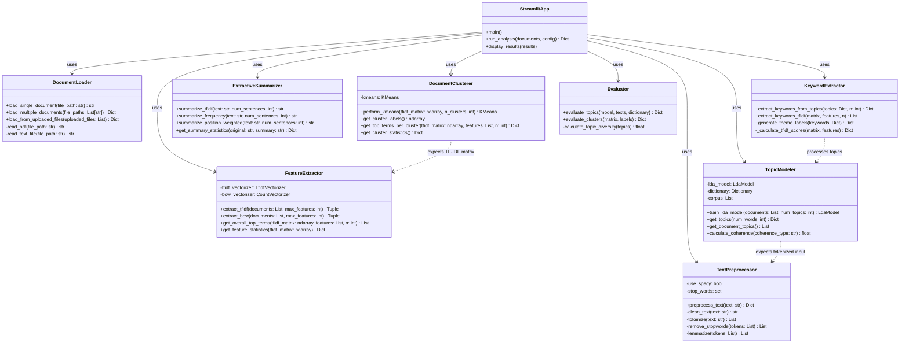
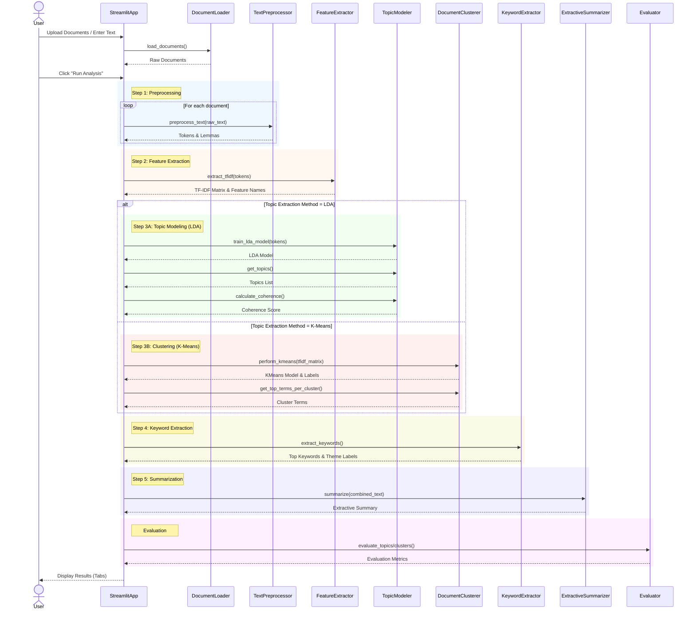

# System UML Diagrams

## 1. Class Diagram

This diagram illustrates the structure of the `Project1-GenAI` system, showing the main classes, their methods, and relationships. The system follows a modular design with a clean separation of concerns.

## 2. Sequence Diagram (Analysis Flow)

This diagram shows the sequence of operations when a user runs an analysis in the Streamlit application.

